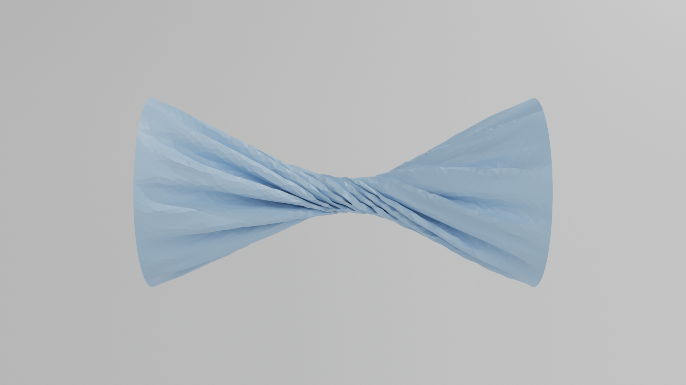

# LuisaComputeSolver: Physics Simulation Based-on LuisaCompute

## How to start

1. Clone the repository: `git clone https://github.com/ChengzhuUwU/libAtsSim.git --recursive`

2. Download required packages: (`brew install` or `vcpkg install`) ` Eigen3, tbb, glfw3`
    - (For windows user: You may need to set `CMAKE_PREFIX_PATH` in 'CmakeLists.txt' with your cmake path)

3. Configure: `cmake -S . -B build -G Ninja -DCMAKE_C_COMPILER=clang -DCMAKE_CXX_COMPILER=clang++`

> Or you can specify the compiler using `-DCMAKE_C_COMPILER=/usr/bin/clang`

4. Build: `cmake --build build -j`

4. Run: `build/bin/app-simulation` or `build/bin/app-simulation.exe`

> Recommend Compiler: [Clang 15~18](https://github.com/llvm/llvm-project/releases/tag/llvmorg-18.1.8)
>
> Recommend Generator: ninja (Use [pre-build](https://github.com/ninja-build/ninja/releases/tag/v1.13.1) or [build from source](https://github.com/ninja-build/ninja))

## Reference

IPC: (PNCG-IPC)(https://github.com/Xingbaji/PNCG_IPC), [libuipc](https://github.com/spiriMirror/libuipc), [solid-sim-toturial](https://github.com/phys-sim-book/solid-sim-tutorial), [C-IPC](https://github.com/ipc-sim/Codim-IPC)

DCD & CCD: [ZOZO's Contact Solver](https://github.com/st-tech/ppf-contact-solver)

PCG (Linear Equation Solver): [MAS](https://wanghmin.github.io/publication/wu-2022-gbm/)

Framework: [libshell](https://github.com/legionus/libshell)

LBVH: libuipc

GPU Intrinsic: [LuisaComputeGaussSplatting](https://github.com/LuisaGroup/LuisaComputeGaussianSplatting)

## 其他

纠结了一下还是先开源一版了

为什么想做这个：狗蛋、minchen、mike、anka、suika、zihang、kemeng、yupeng、xinlei、chenjiong 等老师的开源之光太耀眼了

项目还是非常早期的阶段，仅供学习参考，更完整、严谨的 IPC 仿真框架可以参考 [libuipc](https://github.com/spiriMirror/libuipc) 

- LuisaCompute 的优势：写起来很方便，不用天天手动绑定 Buffer 了（我永远忘不了上个项目写 Metal 的时候绑定参数的痛，即使是bindless 也很难确保不出错）。slang 本质上没有什么区别，调用起来仍然得走传统 API 的范式。LuisCompute 虽然默认是jit，但感觉改成aot问题也不大，是可以用于生产中

- LuisaCompute 的劣势：线性代数部分得自己写，还是有点麻烦的（比如 12x12 的矩阵乘法，稀疏线性系统求解器等），不知道有没有人想一起写 lcm （不过短期内还是还得先忙论文，毕业压力好大 T T ）

下次更新可能是明年了，希望下一篇工作不会又拖得太久