# LuisaComputeSolver: Physics Simulation Based on LuisaCompute

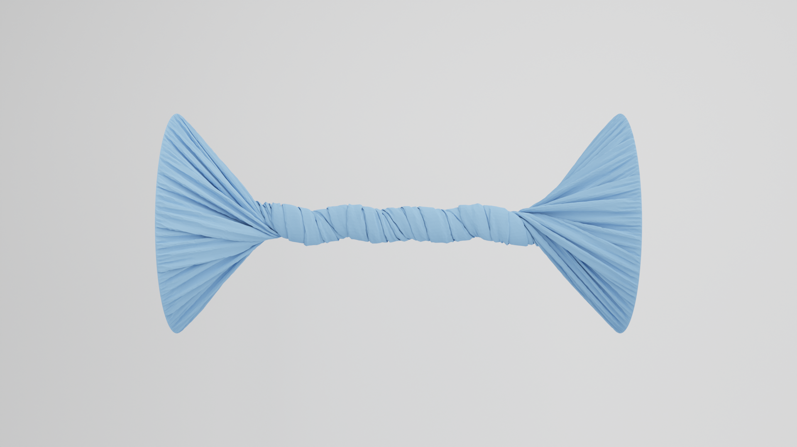

[](https://github.com/ChengzhuUwU/LuisaComputeSimulator/actions/workflows/cmake_linux.yml)
[](https://github.com/ChengzhuUwU/LuisaComputeSimulator/actions/workflows/cmake_windows.yml)
[](https://github.com/ChengzhuUwU/LuisaComputeSimulator/actions/workflows/cmake_macos.yml)


LuisaComputeSimulator is a high-performance cross-platform **Physics Simulatior** based on [LuisaCompute](https://github.com/LuisaGroup/LuisaCompute), which provides support for simulating cloth and rigid body and for **Penetration-Free** contact handling.

## Getting Started

- **Clone the repository:**
    ```git clone https://github.com/ChengzhuUwU/LuisaComputeSimulator.git```

- **Install required packages:**  
    - Cmake > 3.26

    - For Linux and Windows users:
      - To you want to use CUDA backend, you need to install NVIDIA CUDA Toolkit (required: CUDA >= 12.0). Check the maximum supported CUDA version using `nvidia-smi`.

    - For MacOS users:
      - [Xcode](https://developer.apple.com/cn/xcode/) is required for the support of Metal Backend.

    - For Linux users:
      <!-- sudo apt-get update && sudo apt-get upgrade -y
      sudo apt-get install -y software-properties-common
      sudo add-apt-repository -y ppa:ubuntu-toolchain-r/test
      sudo apt-get update -->
      Install required packages:
      ```bash
      sudo apt-get install -y clang-18 wget uuid-dev ninja-build libvulkan-dev libeigen3-dev libx11-dev cmake
      ```

- **You can build with Cmake:**  
  - Congiure: ```cmake -S . -B build```
    - Optionally, you can specify your favorite generators, compilers, or build types by adding parameters `-G Ninja -D CMAKE_C_COMPILER=clang-18 -D CMAKE_CXX_COMPILER=clang++-18 -D CMAKE_BUILD_TYPE=Release` 
    - (Or you can specify the compiler path using `-D CMAKE_C_COMPILER=/usr/bin/gcc-13, -D CMAKE_CXX_COMPILER=/usr/bin/g++-13`).
  - Build   : ```cmake --build build -j```

- **You can also build with Xmake:**  
  - Congiure: ```xmake l setup.lua```
  - Build   : ```xmake build```

- **Run the application:**  
    `build/bin/app-simulation <backend-name> <scene-json-file>` (Linux/macOS)  
    `build/bin/app-simulation.exe  <backend-name> <scene-json-file>` (Windows)
    In lanching arguments, you can specify your favorate backend by passing `<backend-name>` (e.g., `metal/cuda/dx/vulkan`) and choose a simulation scenario by passing `<scene-json-file>` (e.g., `cloth_rigid_coupling_high_res.json`, we provode several example scenarios in `Resources/Scenes` directory).

More configuration support can be found in [the document of LuisaCompute](https://github.com/LuisaGroup/LuisaCompute/blob/stable/BUILD.md) and [Build.md](Document/Build.md).


### Other Configuration

1. The default backend is `cuda` on Windows and Linux, and `metal` on macOS.  
    To use other backends such as `dx`, `vulkan`, or `fallback (TBB)`, update the compile options in CMake/Xmake (e.g., LUISA_COMPUTE_ENABLE_DX or other backend selection) and specify the target backend by passing `<backend-name>` in the launching arguments.

2. GUI is disabled by default for broader platform compatibility.  
    To enable the GUI (based on [polyscope](https://github.com/nmwsharp/polyscope)), set the option `LCS_ENABLE_GUI` to `ON` in CMake/Xmake.

3. Check the generated shader using `echo 'export LUISA_DUMP_SOURCE=0' >> ~/.zshrc` (Shader files will be saved in `build/bin/.cache/`)

## Examples

|       |   |
|  -----   |------|
| Moving Dirichlet Case |  |
| 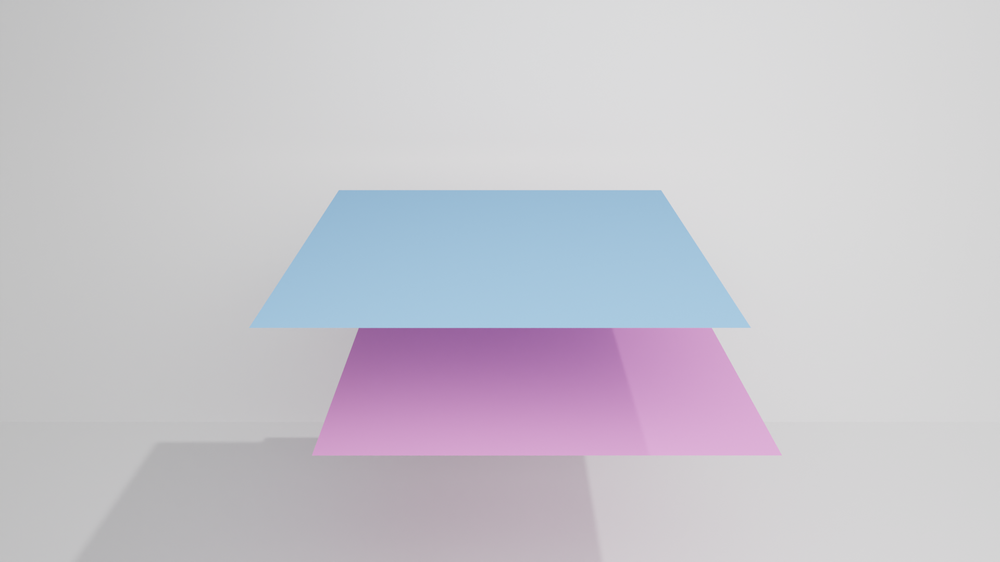 [File](Resources/Scenes/cloth_moving_boundary.json) |  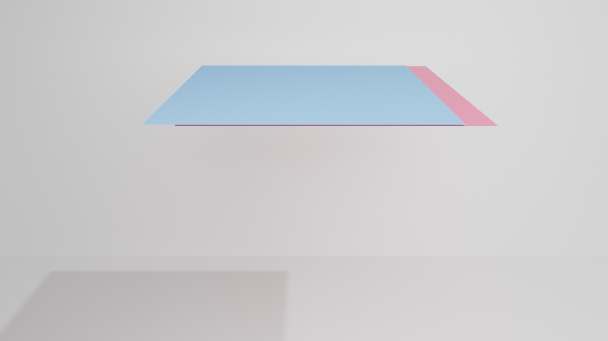 (The velocity of red plane is 3m/s )  |    
|  Different Material Properties | Cloth-Rigid Coupling  Case 1 |
| 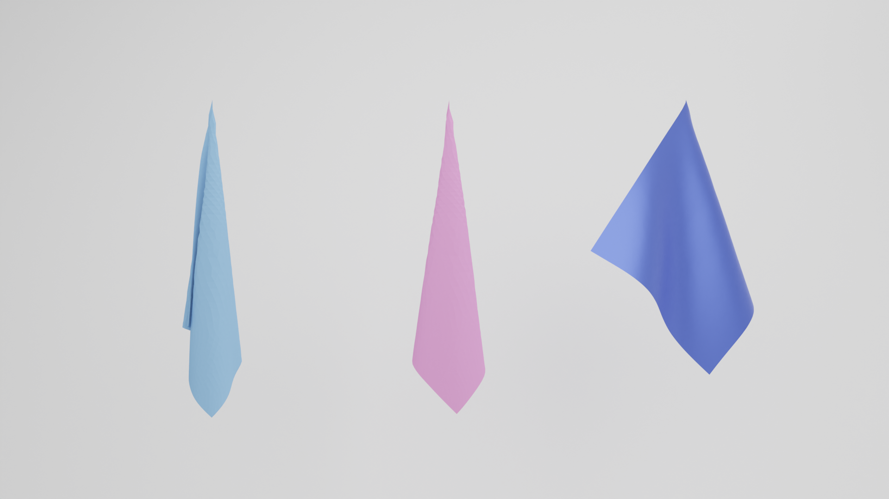 [File](Resources/Scenes/cloth_pinned.json)  |  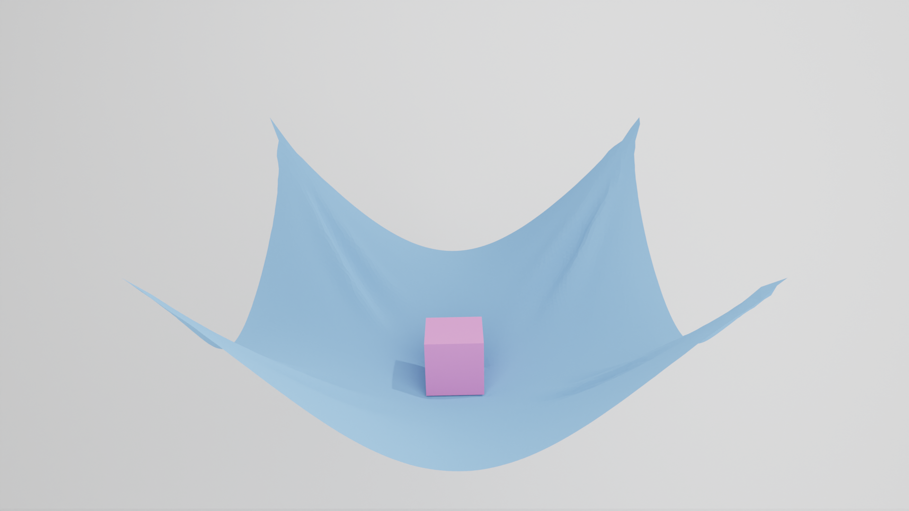 [File](Resources/Scenes/cloth_rigid_coupling_drop.json) |
|   Cloth-Rigid Coupling Case 2 | Rotation Cynlinder (21K DOF) |
| 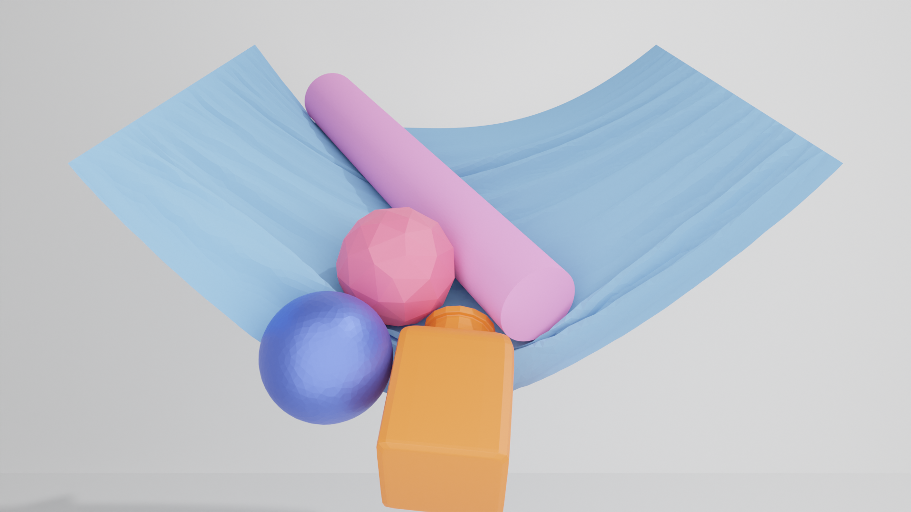 [File](Resources/Scenes/cloth_rigid_coupling_high_res.json)  |  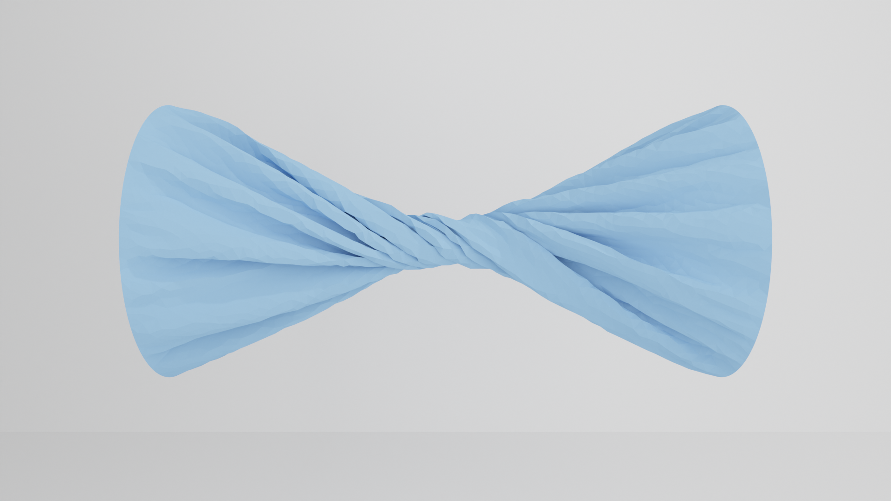 [File](Resources/Scenes/cloth_rotation_cylinder_7K.json) |
|   Rotation Cylinder (260K DOF) | Large Thickness Case |
| 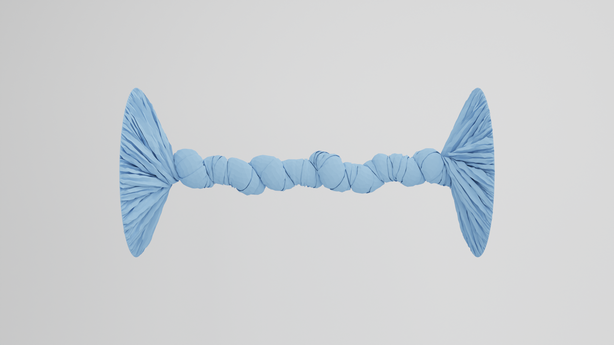 [File](Resources/Scenes/cloth_rotation_cylinder_88K.json)   |  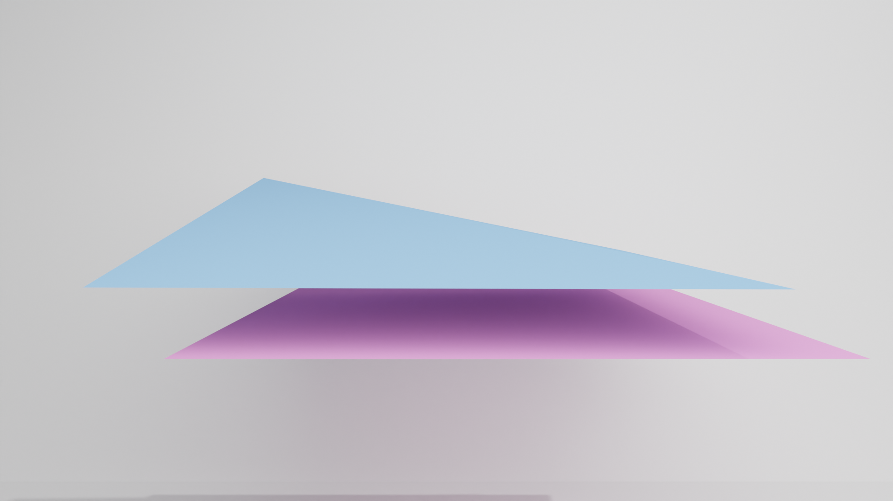 [File](Resources/Scenes/cloth_unit_test_square2.json) |
|   High-Resolusion Rigid-Body Case | Multi-Rigid-Body Case |
| 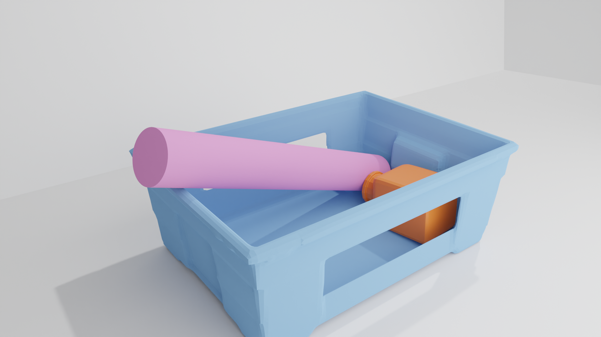  [File](Resources/Scenes/rigid_bucket.json)  |  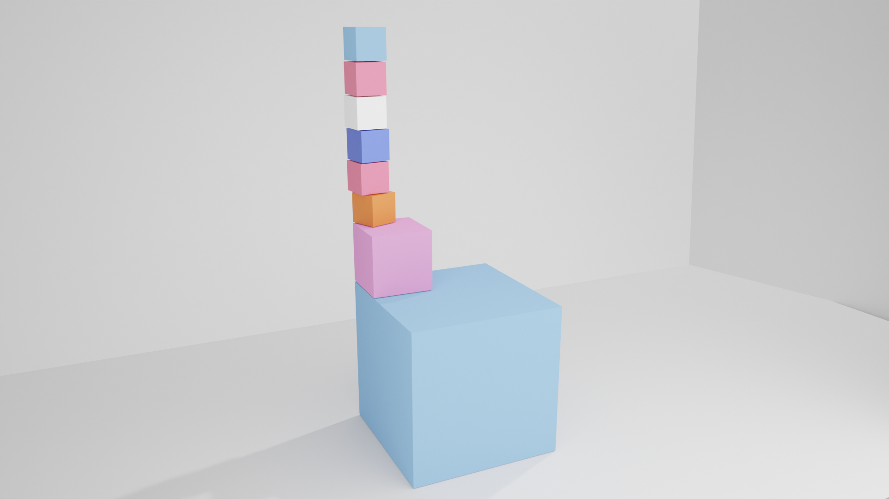 [File](Resources/Scenes/rigid_multi_folding_cubes.json) |

## TODOLIST

[ ] Frictional Contact
[ ] Python Binding
[ ] Thin Shell Rigid-Body Simulation
[ ] Deformable Body Energy and Initilization (And atomatic tetrahedron mesh generation)
[ ] Elastic Rod Energy
[ ] Upper/Lower-Triangle of System Matrix Optization
[ ] GPU-based Global Sort (For Matrix Assembly)


## References

- **Constitutions:** [libuipc](https://github.com/spiriMirror/libuipc), [GAMES 103](https://www.bilibili.com/video/BV12Q4y1S73g) and its [notes](https://zhuanlan.zhihu.com/p/441088912), [PNCG-IPC](https://github.com/Xingbaji/PNCG_IPC), libuipc, [HOBAK](https://github.com/theodorekim/HOBAKv1), [solid-sim-tutorial](https://github.com/phys-sim-book/solid-sim-tutorial), [C-IPC](https://github.com/ipc-sim/Codim-IPC)
- **DCD & CCD:** [ZOZO's Contact Solver](https://github.com/st-tech/ppf-contact-solver), libuipc.
- **PCG (Linear equation solver):** [MAS](https://wanghmin.github.io/publication/wu-2022-gbm/), [AMGCL](https://github.com/ddemidov/amgcl), libuipc.
- **Framework:** [libshell](https://github.com/legionus/libshell), [LuisaComputeGaussSplatting](https://github.com/LuisaGroup/LuisaComputeGaussianSplatting).
- **Dirichlet Boundary Energy:** solid-sim-tutorial.
- **GPU Intrinsic:** LuisaComputeGaussSplatting.
- **Affine Body Dynamics:** [abd-warp](https://github.com/Luke-Skycrawler/abd-warp), libuipc ([documentation](https://spirimirror.github.io/libuipc-doc/specification/constitutions/affine_body/), [theory derivation](https://github.com/spiriMirror/libuipc/blob/main/scripts/symbol_calculation/affine_body_quantity.ipynb)).

## Others

Thanks to LuisaCompute and Libuipc community, their open-source spirit has propelled the advancement of graphics and embodied intelligence.