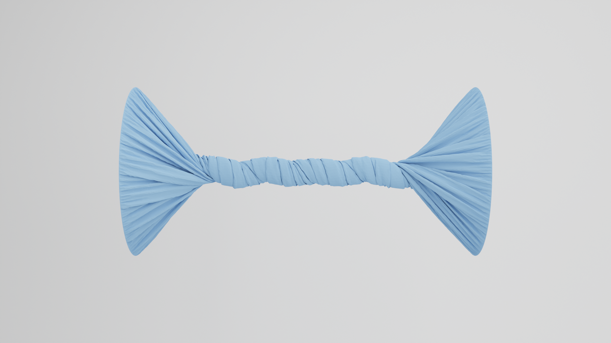
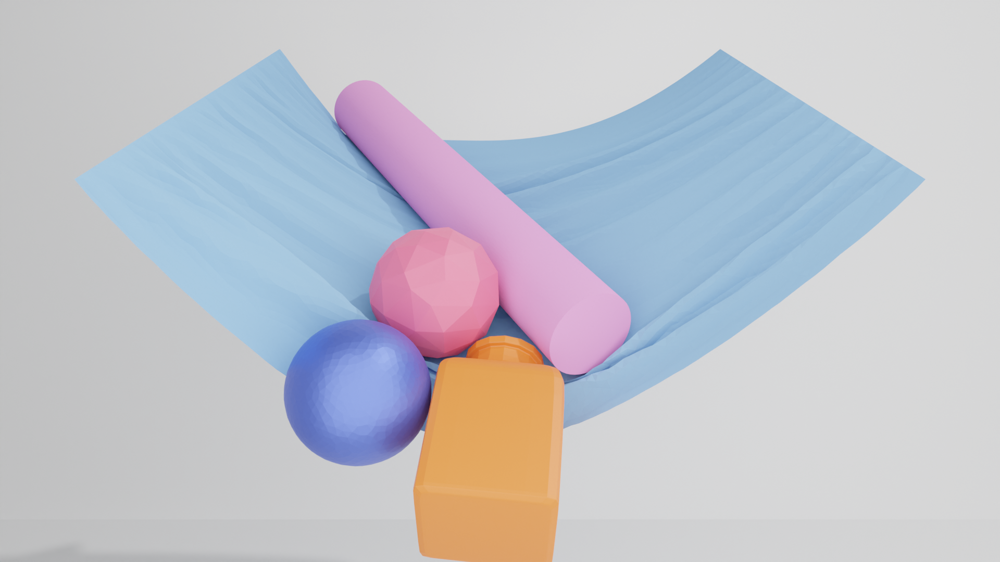
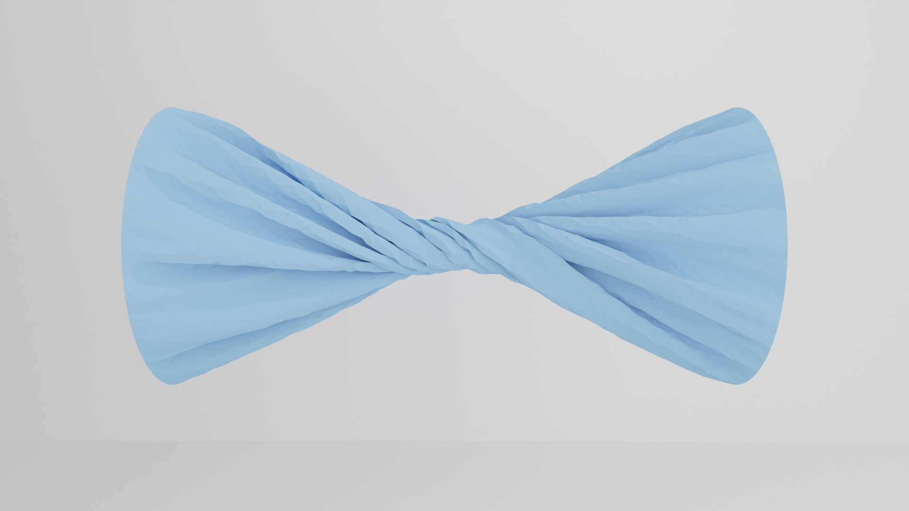
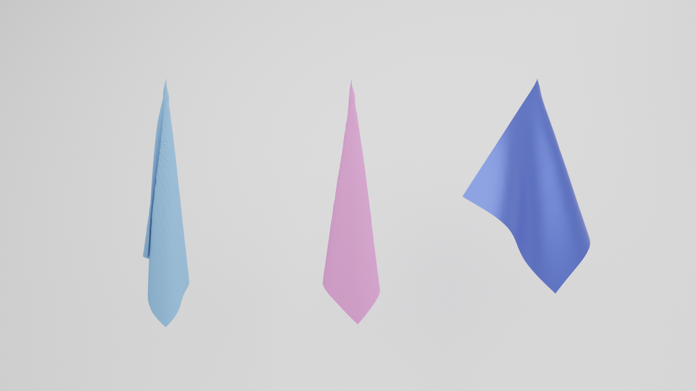
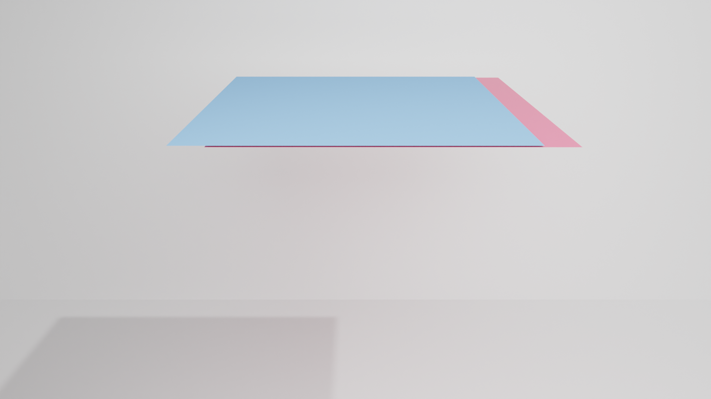
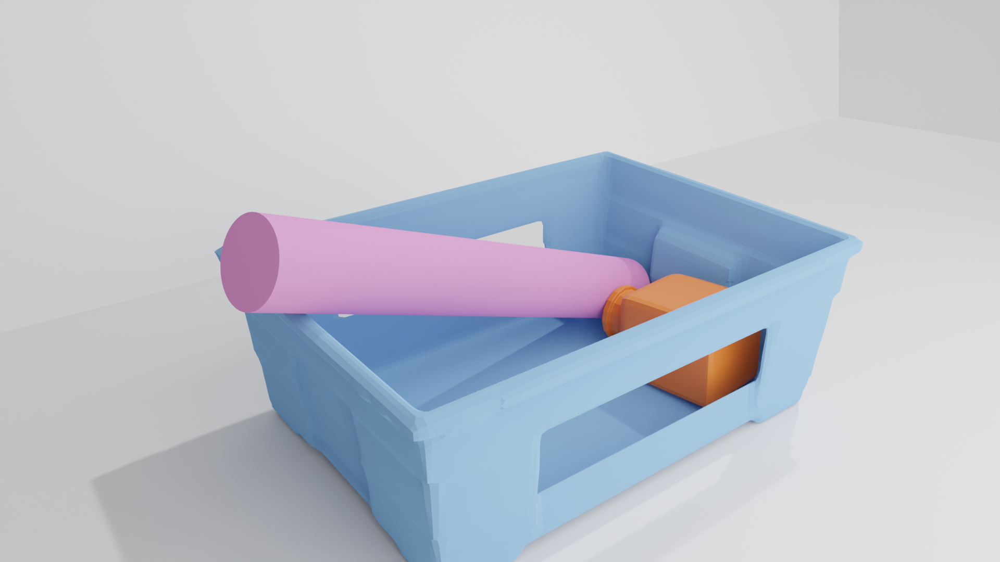
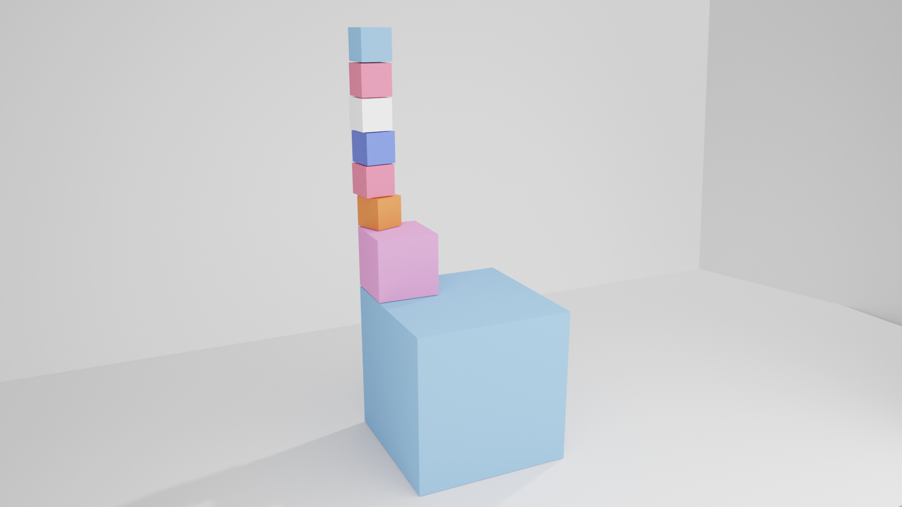
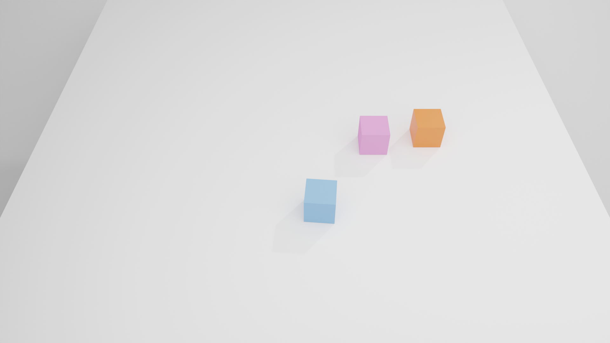

# LuisaComputeSimulator 🧮⚡

<p align="center">
  
</p>

[](https://github.com/ChengzhuUwU/LuisaComputeSimulator/actions/workflows/cmake_linux.yml)
[](https://github.com/ChengzhuUwU/LuisaComputeSimulator/actions/workflows/cmake_windows.yml)
[](https://github.com/ChengzhuUwU/LuisaComputeSimulator/actions/workflows/cmake_macos.yml)
[](LICENSE)

LuisaComputeSimulator is a **high-performance cross-platform physics simulator** built on [LuisaCompute](https://github.com/LuisaGroup/LuisaCompute). It provides real-time simulation of **cloth** and **rigid bodies** with **penetration-free contact handling**, accelerated by GPU/CPU backends.

> **Performance Demo:** 88K vertices, 174K triangles, 3M+ collision pairs → **~3 FPS on RTX 3090 (CUDA)**, **~2 FPS on M2 Max (Metal)**

---

## ✨ Features

| Feature | Description |
|---------|-------------|
| **Cloth Simulation** | High-resolution cloth with various constitutive models (Spring, Finite-Element, etc.) |
| **Rigid Body Dynamics** | Rigid body simulation with collision and friction |
| **Cloth-Rigid Coupling** | Seamless interaction between soft and rigid bodies |
| **Penetration-Free Contact (IPC)** | Robust collision handling using barrier functions |
| **Affine Body Dynamics (ABD)** | Efficient reduced-space simulation for rigid bodies |
| **Multi-Backend Support** | CUDA, DirectX 12, Vulkan, Metal, CPU (Fallback) |
| **Python & C++ APIs** | Flexible programming interfaces for different use cases |
| **Interactive GUI** | Real-time visualization with Polyscope |

### Supported Physics

- ✅ Cloth / Soft Body Simulation
- ✅ Rigid Body Simulation  
- ✅ Cloth-Rigid Body Coupling
- ✅ Ground Collision
- ✅ Frictional Contact
- ✅ Continuous Collision Detection (CCD)
- ✅ Fixed Point / Pinned Constraints
- 🔄 Tetrahedral Mesh (In Development)
- 🔄 Joint Constraints (Planned)

## Usage

### Python Frontend

Sample Python-frontend code can be found at [test_cloth_rigid_coupling.py](PythonBindings/tests/test_cloth_rigid_coupling.py):

```python
    from sim_utils import parse_args
    import lcs_py as lcs
    args = parse_args()

    solver = lcs.NewtonSolver()
    solver.init_device(backend_name=args.backend, binary_path=None)

    # Build 2 world_data objects first: a rigid cube and a soft cloth
    cube_mesh_path = os.path.join(root, 'Resources', 'InputMesh', 'cube.obj')
    cube_mesh = trimesh.load(cube_mesh_path, process=False)
    cube_wd = solver.create_world_data_from_array('cube', cube_mesh.vertices, cube_mesh.faces)
    cube_wd.set_simulation_type(lcs.MaterialType.Rigid)
    cube_wd.set_translation(0.0, 0.34, 0.0)
    cube_wd.set_rotation(0.5235988, 0.0, 0.5235988)
    cube_wd.set_scale(0.1)
    cube_id = solver.register_world_data(cube_wd)

    cloth_mesh_path = os.path.join(root, 'Resources', 'InputMesh', 'square2K.obj')
    cloth_wd = solver.create_world_data_from_file_path('cloth', cloth_mesh_path)
    cloth_wd.set_simulation_type(lcs.MaterialType.Cloth)
    cloth_wd.set_physics_material_cloth(thickness=0.001, youngs_modulus=1e6)
    cloth_wd.set_scale(0.75)
    cloth_wd.add_fixed_point_by_method("LeftBack")
    cloth_id = solver.register_world_data(cloth_wd)

    # register_world_data(...) returns object id.
    # After registration, query objects via const access APIs, e.g.:
    cube_const = solver.get_object_by_registration_id(cube_id)

    # Initialize the solver
    solver.init_solver()

    config_ref = solver.get_config()
    config_ref.use_floor = False
    config_ref.implicit_dt = 1/60

    output_dir = os.path.join(root, "Resources", "OutputMesh")

    # Launch simulation
    if args.headless:
        solver.save_sim_result(obj_path=os.path.join(output_dir, "init.obj"))
        for frame in range(0, args.advance_frames):
            solver.physics_step_gpu() # or solver.physics_step_cpu()
        solver.save_sim_result(obj_path=os.path.join(output_dir, "result.obj"))
    else:
        from polyscope_gui import SimulationGUI
        gui = SimulationGUI(solver, config_ref, output_dir)
        gui.show()
```

### Cpp Frontend

Sample Cpp-frontend code can be found at [app_integration.cpp](Application/app_integration.cpp).

```C++
    #include "SimulationSolver/newton_solver.h"

    int main(int argc, char** argv)
    {
        lcs::NewtonSolver solver;
        solver.create_device(/*binary_path =*/argv[0], /*backend =*/ "cuda");

        // Build world_data using file path, then register
        auto upper_square = lcs::Initializer::WorldData()
                                .set_name("upper square")
                                .load_mesh_from_path(std::string(LCSV_RESOURCE_PATH) + "/InputMesh/square2.obj")
                                .set_material_type(lcs::Material::MaterialType::Cloth)
                                .set_physics_material(lcs::Material::ClothMaterial{
                                    .stretch_model = lcs::Initializer::ConstitutiveStretchModelCloth::Spring,
                                })
                                .set_translation({ 0.0f, 0.4f, 0.0f });
        uint upper_square_id = solver.register_world_data(upper_square);

        // Build world_data using array, then register
        std::vector<std::array<float, 3>> square_mesh_vertices{ { -0.5, 0, -0.5 }, { 0.5, 0, -0.5 }, { -0.5, 0, 0.5 }, { 0.5, 0, 0.5 } };
        std::vector<std::array<uint, 3>>  square_mesh_faces{ { 0, 3, 1 }, { 0, 2, 3 } };
        auto lower_square = lcs::Initializer::WorldData()
                                .set_name("lower square")
                                .load_mesh_from_array(square_mesh_vertices, square_mesh_faces)
                                .set_physics_material(lcs::Material::ClothMaterial{}) 
                                .set_scale(0.8f)
                                .set_translation({ 0.1f, 0.2f, 0.0f })
                                .add_fixed_point_info({ .method = lcs::Initializer::FixedPointsType::Left })
                                .add_fixed_point_info({ .method = lcs::Initializer::FixedPointsType::Right });
        uint lower_square_id = solver.register_world_data(lower_square);

        // Scene configs
        auto config = solver.get_config();
        config.use_floor = false;
        config.implicit_dt = 0.2;
        config.use_energy_linesearch = true;

        solver.init_solver();

        // Init rendering data
        std::vector<std::vector<std::array<float, 3>>> sa_rendering_vertices;
        solver.get_curr_vertices_to_host(sa_rendering_vertices);

        // Main application
        for (uint ii = 0; ii < 20; ii++)
        {
            solver.physics_step_GPU();
            solver.get_curr_vertices_to_host(sa_rendering_vertices);
            // Display or other processing
        }

        return 0;
    }
```

## 🚀 Quick Start

### 1. Clone & Build

```bash
# Clone the repository
git clone https://github.com/ChengzhuUwU/LuisaComputeSimulator.git
cd LuisaComputeSimulator

# Configure and build (CMake)
cmake -S . -B build -DCMAKE_BUILD_TYPE=Release
cmake --build build -j

# Or use Xmake
xmake lua setup.lua
xmake build
```

### 2. Run a Demo

#### C++ Application
```bash
# Run with default scene
./build/bin/app-simulation

# Specify backend and scene
./build/bin/app-simulation cuda Resources/Scenes/cloth_rigid_coupling_high_res.json
```

#### Python Application
```bash
# With GUI (requires polyscope)
python PythonBindings/example_usage.py --backend cuda

# Headless mode (batch processing)
python PythonBindings/example_usage.py --backend cuda --headless --advance_frames 60
```

> **Note:** Supported backends: `cuda`, `dx` (DirectX), `vk` (Vulkan), `metal` (macOS)

---

## 📖 Usage

### Python Frontend

Sample code for cloth-rigid coupling simulation:

```python
import trimesh
import lcs_py as lcs

# Initialize solver with backend
solver = lcs.NewtonSolver()
solver.init_device(backend_name="cuda")

# Create rigid body from mesh file
cube_mesh = trimesh.load("cube.obj", process=False)
cube = solver.create_world_data_from_array("cube", cube_mesh.vertices, cube_mesh.faces)
cube.set_simulation_type(lcs.MaterialType.Rigid)
cube.set_translation(0.0, 0.34, 0.0)
cube.set_scale(0.1)
cube_id = solver.register_world_data(cube)

# Create cloth from file
cloth = solver.create_world_data_from_file_path("cloth", "square2K.obj")
cloth.set_simulation_type(lcs.MaterialType.Cloth)
cloth.set_physics_material_cloth(thickness=0.001, youngs_modulus=1e6)
cloth.set_scale(0.75)
cloth.add_fixed_point_by_method("LeftBack")
cloth_id = solver.register_world_data(cloth)

# Configure simulation
config = solver.get_config()
config.use_floor = False
config.implicit_dt = 1/60

# Initialize and run
solver.init_solver()

for frame in range(100):
    solver.physics_step_gpu()
    solver.save_sim_result(f"output/frame_{frame}.obj")
```

### C++ Frontend

```cpp
#include "SimulationSolver/newton_solver.h"

int main(int argc, char** argv) {
    lcs::NewtonSolver solver;
    solver.create_device(argv[0], "cuda");

    // Build cloth simulation
    auto cloth = lcs::Initializer::WorldData()
        .set_name("cloth")
        .load_mesh_from_path("square2.obj")
        .set_material_type(lcs::Material::MaterialType::Cloth)
        .set_physics_material(lcs::Material::ClothMaterial{
            .stretch_model = lcs::Initializer::ConstitutiveStretchModelCloth::Spring,
        })
        .set_translation({0.0f, 0.4f, 0.0f});
    uint cloth_id = solver.register_world_data(cloth);

    // Configure and run
    auto config = solver.get_config();
    config.use_floor = false;
    solver.init_solver();

    for (uint i = 0; i < 20; i++) {
        solver.physics_step_GPU();
    }
    return 0;
}
```

---

## 🎯 Example Scenes

Pre-built scenes in `Resources/Scenes/`:

| Scene File | Description | Mesh Size |
|------------|-------------|-----------|
| `cloth_rigid_coupling_high_res.json` | High-res cloth dropping on rigid cube | 88K vertices |
| `cloth_rigid_coupling_drop.json` | Cloth falling onto cube | ~2K vertices |
| `cloth_rotation_cylinder.json` | Cloth wrapping around rotating cylinder | 7K / 88K / 260K |
| `cloth_pinned.json` | Pinned cloth with different materials | ~2K vertices |
| `cloth_friction.json` | Cloth with frictional contact | ~2K vertices |
| `rigid_folding_cubes.json` | Multiple folding rigid cubes | 3 cubes |
| `rigid_multi_folding_cubes.json` | Many folding cubes | 8 cubes |
| `rigid_bucket.json` | Rigid objects in bucket | ~1K vertices |
| `rigid_frictional_test.json` | Frictional sliding test | - |

---

## 🖥️ Supported Backends

|   Backend |  Windows   | Linux     |  MacOS  | Description |
|  -----    |  ------    |  ------   |  ------ |      ------ |
| CUDA      | Supported  | Supported |         | Requires [CUDA Toolkit](https://developer.nvidia.com/cuda-toolkit-archive) (CUDA > 12.0) | 
| Vulkan    | Supported  | Experimental | Developing  | Requires [vulkan SDK](https://vulkan.lunarg.com/). Linux (currently for x86_64 only) and Macos is in development | 
| DirectX12 | Supported  |           |           |   | 
| Metal     |            |           | Supported |   | 
| Fallback  | Supported  | Supported | Supported | CPU fallback via TBB/Embree. Requires [llvm](https://llvm.org/), [TBB](https://github.com/uxlfoundation/oneTBB) and [Embree](https://github.com/RenderKit/embree) |

---

## 📊 Gallery

### Rotation Cylinder Demo
| 88K vertices, 174K triangles, 3M+ collision pairs |
|  -----   |
|   |
| **~3 FPS on RTX 3090 (CUDA)**, **~2 FPS on M2 Max (Metal)** |

### More Examples

| Scene | Preview | Description |
|-------|---------|-------------|
| [Cloth-Rigid Coupling](Resources/Scenes/cloth_rigid_coupling_high_res.json) |  | High-res cloth on rigid cube |
| [Rotation Cylinder 7K](Resources/Scenes/cloth_rotation_cylinder_7K.json) |  | Cloth wrapping cylinder |
| [Pinned Cloth](Resources/Scenes/cloth_pinned.json) |  | Different material properties |
| [Moving Boundary](Resources/Scenes/cloth_moving_boundary.json) |  | Dynamic Dirichlet boundary |
| [Rigid Bucket](Resources/Scenes/rigid_bucket.json) |  | Multi-body collision |
| [Folding Cubes](Resources/Scenes/rigid_multi_folding_cubes.json) |  | Self-collision folding |
| [Friction Test](Resources/Scenes/rigid_frictional_test.json) |  | Frictional contact |

---

## 🛤️ Roadmap

### Completed ✅
- [x] Python Bindings
- [x] Cloth & Rigid Body Simulation
- [x] Penetration-Free Contact (IPC)
- [x] Affine Body Dynamics
- [x] Frictional Modeling
- [x] C++ Integration API

### In Progress 🔄
- [ ] Tetrahedral Mesh Support
- [ ] Joint Constraints
- [ ] Elastic Rod Energy

### Planned 📋
- [ ] UV Mapping Package
- [ ] Strain Limiting
- [ ] Consistent Solve
- [ ] Thin Shell Rigid-Body
- [ ] Matrix Assembly Optimization
- [ ] Better Preconditioners

---

## 📚 References

- **Constitutions:** [libuipc](https://github.com/spiriMirror/libuipc), [GAMES 103](https://www.bilibili.com/video/BV12Q4y1S73g), [PNCG-IPC](https://github.com/Xingbaji/PNCG_IPC), [HOBAK](https://github.com/theodorekim/HOBAKv1), [solid-sim-tutorial](https://github.com/phys-sim-book/solid-sim-tutorial), [Codim-IPC](https://github.com/ipc-sim/Codim-IPC), [ZOZO's Contact Solver](https://github.com/st-tech/ppf-contact-solver)
- **DCD & CCD:** ZOZO's Contact Solver, libuipc.
- **PCG (Linear Equation Solver):** [MAS](https://wanghmin.github.io/publication/wu-2022-gbm/), [AMGCL](https://github.com/ddemidov/amgcl), libuipc.
- **Framework:** [libshell](https://github.com/legionus/libshell), [LuisaComputeGaussSplatting](https://github.com/LuisaGroup/LuisaComputeGaussianSplatting).
- **GPU Intrinsic:** LuisaComputeGaussSplatting.
- **Collision Energy:** MAS, [PNCG-IPC](https://github.com/Xingbaji/PNCG_IPC)
- **Affine Body Dynamics:** [abd-warp](https://github.com/Luke-Skycrawler/abd-warp), libuipc ([documentation](https://spirimirror.github.io/libuipc-doc/specification/constitutions/affine_body/), [theory derivation](https://github.com/spiriMirror/libuipc/blob/main/scripts/symbol_calculation/affine_body_quantity.ipynb)).

---

## 📄 License

This project is licensed under the **MIT License**. See [LICENSE](LICENSE) for details.

---

## 🙏 Acknowledgments

Thanks to the [LuisaCompute](https://github.com/LuisaGroup/LuisaCompute) and [libuipc](https://github.com/spiriMirror/libuipc) communities for their open-source contributions to physically-based simulation.

---

<p align="center">
  <b>LuisaComputeSimulator</b> — High-Performance Physics Simulation 📈
</p>